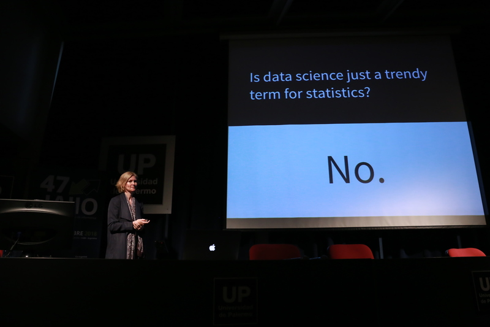
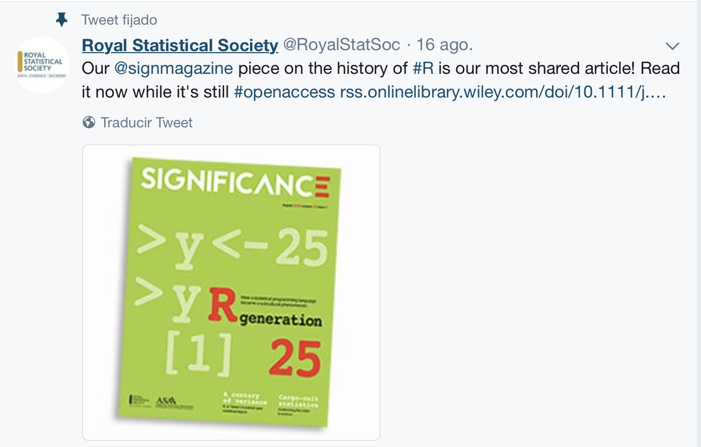
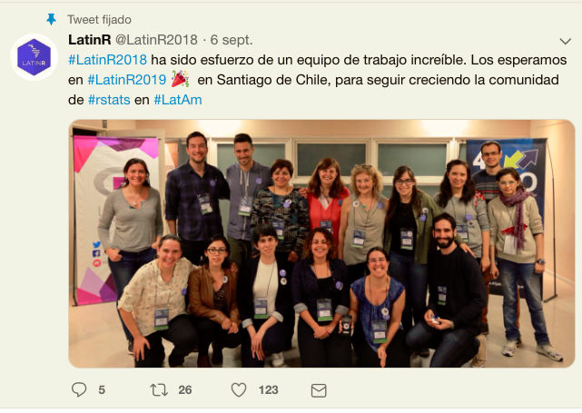
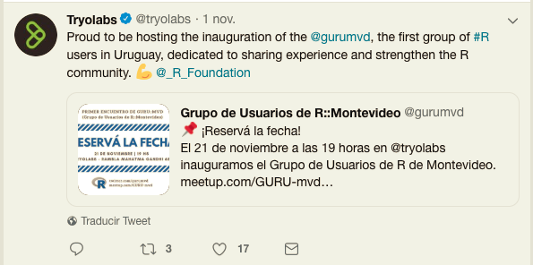

```{r setup, include=FALSE}
options(htmltools.dir.version = FALSE)
knitr::opts_chunk$set(echo = TRUE, warning = FALSE, message = FALSE)
```
## La ciencia de datos



---

## La ciencia de datos

- Es difícil pensar en algún área de la ciencia, industria o gobierno donde no se ha utilizado el término: *Data Science*

- The American Statistical Association (ASA, 2015), identifica tres 
áreas fundamentales:
    - Manejo de bases de datos: transformación, organización y agrupamiento de datos
    - Estad\'istica: transformar los datos en conocimiento 
    - Sistemas: infraestructura computacional para el análisis de datos
    
---

## 50 Years of Data Science

Trabajo en JCGS (2017) de David Donoho, donde revisa 4 trabajos clave: 

1. John Tukey: “The Future of Data Analysis” (1962)

2. John Chambers: “Greater or Lesser Statistics: A Choice for Future Research” (1993)

3. Leo Breiman: “Statistical Modeling: The Two Cultures” (2001)

4. William S. Cleveland: “Data Science: An Action Plan for Expanding the Technical Areas of the Field of Statistics” (2001)
---
## Lenguaje  R


https://rss.onlinelibrary.wiley.com/doi/10.1111/j.1740-9713.2018.01169.x

---
## Lenguaje  R

Es uno de los lenguajes más comunmente utilizado para ciencia de datos 

- **Extensible:** Ecosistema de bibliotecas, 
  - CRAN (15000 bibliotecas)
  - Bioconductor (2000 bibliotecas)
  - Github (versiones de desarrollo)
  - Ropensci 

- **Basado en comunidades:**
  - Grupos de Usuarios
  - Rladies
  - Rforwards

---
---  

## ¿Te acordás de esta foto ?


---

## LatinR 2018
Primer conferencia de uso y desarrollo de `R` en América Latina. 



---
## ¿Porqué un Grupo de Usuarios ? 

- Mucha gente interesada

    - Cursos de R en FCS, FCIEN, FCEA, CURE
    
    - Lic. Estadística de FCEA,FCIEN y FING
   
    - https://espejito.fder.edu.uy/

- Aportar a la comunidad `R` en la región     
    
---

## R-Ladies Montevideo

- Primer iniciativa de comunidad R en Montevideo 

R-Ladies: organización internacional que promueve la diversidad de género en la comunidad de R en un espacio amigable y seguro. 

- Primer encuentro Agosto 2017
-  169 miembros 

Contacto:

 meetup rladies.uy
 
 twitter: @RLadiesMVD
 
 Facebook: RLadiesMVD
 
 email: montevideo@rladies.org
---

## R-consortium

- Brinda soporte a GURU::mvd (y todos los grupos de usuarios a nivel global)

- Código de conducta: Una comunidad *abierta*, *considerada* y *respetuosa* 
https://wiki.r-consortium.org/view/R_Consortium_and_the_R_Community_Code_of_Conduct


---

## Tryolabs



---
## Rladies


---

## Se viene el Popurri!!!


