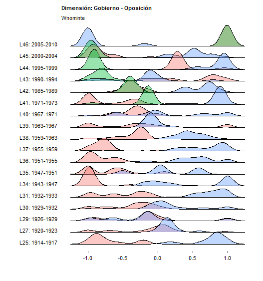
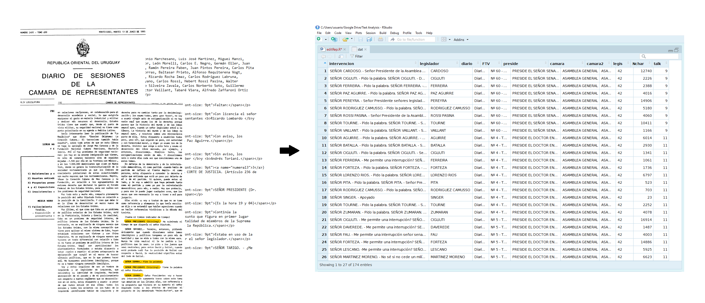
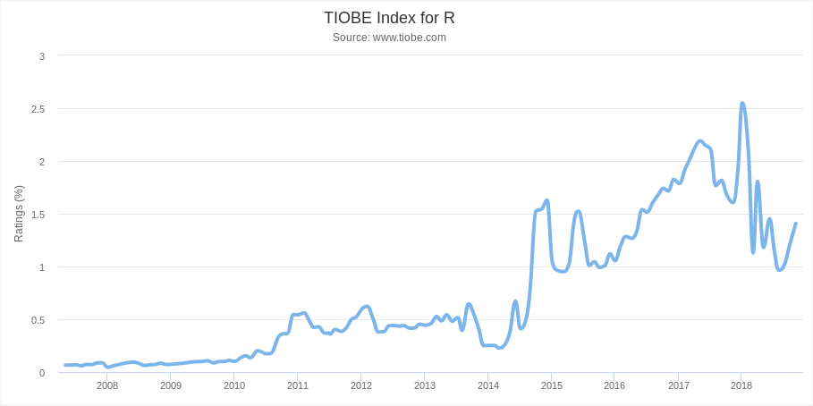
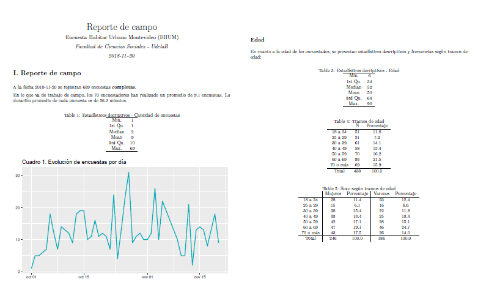
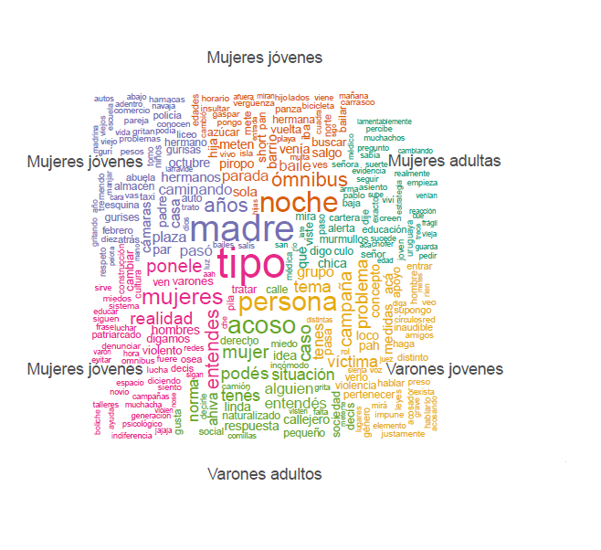
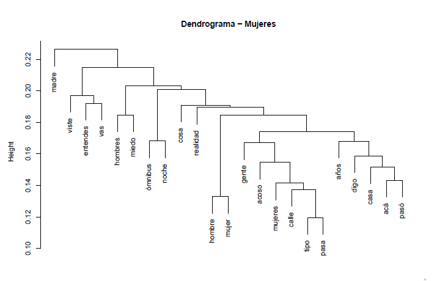

```{r setup, include=FALSE}
options(htmltools.dir.version = FALSE)
knitr::opts_chunk$set(echo = TRUE, warning = FALSE, message = FALSE)
```


class: inverse, center, middle
# Muchas gracias por participar!!
---

## La ciencia de los datos


---

## La ciencia de los datos

- Es difícil pensar en algún área de la ciencia, industria o gobierno donde no se ha utilizado el término: *Data Science*

- The American Statistical Association (ASA, 2015), identifica tres 
áreas fundamentales:
    - Manejo de bases de datos: transformación, organización y agrupamiento de datos
    - Estadística: transformar los datos en conocimiento 
    - Sistemas: infraestructura computacional para el análisis de datos
    
- ¿Cómo interactúan estadística, data science, análisis de datos y `R` ? 

---
## 50 Years of Data Science

Trabajo en JCGS (2017) de David Donoho, donde revisa 4 trabajos clave: 

1. John Tukey: “The Future of Data Analysis” (1962)

2. John Chambers: “Greater or Lesser Statistics: A Choice for Future Research” (1993)

3. Leo Breiman: “Statistical Modeling: The Two Cultures” (2001)

4. William S. Cleveland: “Data Science: An Action Plan for Expanding the Technical Areas of the Field of Statistics” (2001)
---

## 50 Years of Data Science

- *... mi interés central es en el análisis de datos .. * (Tukey, 1962)

- *... el análisis de datos es una disciplina compleja, debe adaptarse a lo que la gente puede y necesita hacer con datos. * (Tukey, 1962)

- *...estadística enfrenta una elección entre la visión de estadística matemática y una visión más amplia de aprender de los datos..* (Chambers, 1993)

- esfuerzo: *... modelos y métodos para datos (20%), cómputo con datos (15%), teoría (20%), ...* (Cleveland, 2001)

- *... modelado predictivo puede ser usado para analizar conjuntos de datos grandes y complejos ...*  (Brieman, 2001)
---

## De todas partes ... 

Ciencia de datos: 

1. Toda la estadística

2. Otras ciencias (todas?) donde el manejo de datos es clave

---
class: inverse, center, middle
# Lenguaje  R
---

## 25 años ... un montonaso! 


https://rss.onlinelibrary.wiley.com/doi/10.1111/j.1740-9713.2018.01169.x

---
## Lenguaje  R

Es uno de los lenguajes más comunmente utilizado para ciencia de datos. 
Es el estandar de la comunidad estadística. 

- **Extensiones:**
  - `C++` , `python`
  - R notebooks, Shiny apps
  - Reportes dinámicos y reproducibles
  
- **Ecosistema de bibliotecas:** 
  - CRAN (15000 bibliotecas)
  - Bioconductor (2000 bibliotecas)
  - Github (versiones de desarrollo)
  - Ropensci 

- **Comunidades:**
  - Grupos de Usuarios
  - Rladies
  - Rforwards
---  
---

## ¿Te acordás de esta foto ?


---

## LatinR 2018
Primer conferencia de uso y desarrollo de `R` en América Latina. 


---
## ¿Porqué un Grupo de Usuarios ? 

- Mucha gente interesada

    - Cursos de R en FCS, FCIEN, FCEA, CURE
    
    - Lic. Estadística de FCEA,FCIEN y FING
   
    - https://espejito.fder.edu.uy/

- Aportar a la comunidad `R` en la región     
    
---

## R-Ladies Montevideo

- Primer iniciativa de comunidad R en Montevideo 

R-Ladies: organización internacional que promueve la diversidad de género en la comunidad de R en un espacio amigable y seguro. 

- Primer encuentro Agosto 2017
-  169 miembros 

Contacto:

 meetup rladies.uy
 
 twitter: @RLadiesMVD
 
 Facebook: RLadiesMVD
 
 email: montevideo@rladies.org
---

## R-consortium

- Brinda soporte a GURU::mvd (y todos los grupos de usuarios a nivel global)

- Código de conducta: Una comunidad *abierta*, *considerada* y *respetuosa* 
https://wiki.r-consortium.org/view/R_Consortium_and_the_R_Community_Code_of_Conduct


---

## Tryolabs


---

class: inverse, center, middle

## Se viene el Popurri!!!
---


## Natalia da Silva, @pacocuak

- Profesora Adjunta en el Instituto de Estadística (IESTA-UDELAR)

-  Lic. en Estadística y Lic. Economía: UDELAR

- Doctorado y Maestría en Estadística: Iowa State University, USA

- Investigación: aprendizaje automático, estadística computacional, visualización estadística y meta-análisis 

- Primeros pasos en `R`: como estudiante de Lic. Estadística (IESTA-UdelaR) ... cerca de 100 años atrás

- R-Ladies Ames, R-Ladies Montevideo y ahora GURU::mvd
---

## Ejemplos de lo que hago en R! </span>

- **Paquetes:** https://cran.r-project.org/web/packages/PPforest/index.html

- **Reportes interactivos:** https://arxiv.org/pdf/1807.07207.pdf

- **Shiny apps:** https://ndasilva.shinyapps.io/shiny-pov/

- **Página personal:**  http://natydasilva.com

- **Slides:** https://natydasilva.github.io/taller_LatinR/#1

- **Curso en Lic. Estadística:** "Nuevas tecnologías para el análisis estadístico de datos"

---
<style>
  .col2 {
    columns: 2 200px;         
    -webkit-columns: 2 200px; 
    -moz-columns: 2 200px;    
  }
</style>

## Nicolás Schmidt, @nicosch14

- Docente e investigador en el Departamento de Ciencia Política - FCS
- Primeros pasos en `R`: como ayudante de investigacion en FCEA. Necesidad de automatizar tareas que me dejaran tiempo para estudiar...

--

Mi primer función en R!:
```{r}
funcion_diaria <- function(paquete = "base"){
          ruta <- search()
          l <- ls(ruta[which(ruta==paste0("package:", paquete))])
          sample(l, 1)
}
funcion_diaria()
```


---
## Qué hago en R...


<div class="col2">

- Estudio sistemas electorales y sistemas de partidos y cómo éstos impactan en el regimen de gobierno.
- Producto de esto hice un paquete para simplificarme la vida:

     
     
- **esaps**: *Indicators of Electoral Systems and Party Systems*
- **Votaciones nominales en congresos:** Simulacion MCMC,  multidimensional scaling...



---
## Actualmente... más de lo mismo pero con Text Analysis


---

## Guzmán López, @guzilop

- Desarrollador en el Instituto Uruguayo de Meteorología (INUMET)
- Lic. en Ciencias Biológicas (FCien-UdelaR)

- Estudié programación en la ORT y más de "autodidacta"
- Primeros pasos en `R`: como estudiante de FCien en 2009

--

## Qué cosas hago/hice en R...

- Desarrollando herramientas de monitoreo y visualización para meteorología:
  - {Elastic Stack, Grafana, Docker} + R y Python
  
- Antes: acústica submarina, oceanografía y tráfico marítimo
  - R como SIG (`sp`, `sf`, `leaflet`, `mapview`, `raster`)
  - Geoestadística (`gstat`, `geoR`)
  - Aplicaciones web (`shiny`)
---

## Qué intereses tengo actualmente...

- Integración de R con otras tecnologías
- R en producción
- R + Python = <3
- Machine Learning para la maestría
- Que `R` siga creciendo...



---
  
## Elina Gómez, @elinagomezb
  
- Socióloga - UdelaR

- Maestría en Estudios Contemporáneos de América Latina (DS - FCS - UdelaR) (_tesis pendiente_)

- Asistente técnica Dirección Nacional de Evaluación y Monitoteo (MIDES) y DS - FCS

- Primeros pasos en `R` + `Latex`: compañerxs de trabajo me convencieron de la utilidad de R para el trabajo

**Dictado:**

- Cursos internos de iniciación en R en DINEM - MIDES

- Curso _R: informes automatizados y análisis de datos en un único software_ (Educación Permanente - FCS - UdelaR)

---
  
## Qué hago en R...
  
- Manipulación y procesamiento de bases de datos

- Automatización de informes sistemáticos con indicadores de monitoreo de Programas sociales (MIDES) y otros proyectos específicos

- **knitr**, **R Markdown**, **tidyverse** y otros...


  
  
---
  
## Qué hago en R...
  
  <div class="col2">
    
- Análisis cualitativo y textual
  
- _Codificación de textos, nubes de palabras, análisis de asociación, agrupación jerárquica, análisis de sentimiento_
  
- **RQDA**, **tm**, **quanteda**
    
  
  
        
---

## Florencia Díaz Viraqué, @fdiazviraque

Estudiante de doctorado, Investigador Asistente en Laboratorio de Interacción Hospedero-Patógeno, Institut Pasteur Montevideo

- Lic. en Bioquímica

- Maestría en Biologia Celular y Molecular

- Facultad de Ciencias, UdelaR

---

## Qué hago en R...

Investigación: ensamblado de genoma, análisis de transcriptoma, análisis y visualización de secuencias biológicas

Paquetes con los que suelo trabajar:

- library(“seqinr”)
- library(“Rsubread”)
- library(“DESeq2”)
- library(“GenomicRanges”)
- library(“ggplot2”)
- library(“pheatmap”)
- library(“geneplotter”)
- library(“karyoploteR”)

Muchas gracias!

---

## Ignacio Alvarez-Castro, @nachalca

- Profesor Adjunto en el Instituto de Estadística (IESTA-UDELAR)
- Primeros pasos en `R`: como estudiante de Lic. Estadística (IESTA-UdelaR) ... cerca de 2003

--

## Qué cosas hago en R...

- Estadística Bayesiana (**STAN**, JAGS, INLA, NIMBLE)

*''The systematic application of probabilistic reasoning to all inferential problems, including inferring parameters of statistical models, is sometimes called a Bayesian approach''* 

**Machine Learning - A probabilistic perspective**, Kevin Murphy. 

---
## Redescubrir funciones de `R-base`

```{r}
library(tidyverse)
library(stringr)

"http://www.impo.com.uy/convenios/1261-011.pdf" %>%
  as_data_frame() %>%
  mutate(aux=str_extract_all(value, pattern = '[[:digit:]]+') ) %>%
  mutate(doc=map(aux, paste0, collapse="-")) %>%
  unnest(doc) %>%
  mutate( destino  =  paste0(doc, '.pdf', sep = '') ) %>%
  pull( destino )
```

--

```{r}
"http://www.impo.com.uy/convenios/1261-011.pdf" %>%
  basename()
```

---

## Daniela Vázquez, @d4tagirl

- Economista.
- Data Scientist Freelance (actualmente trabajando para Pyxis).
- Blog: dv.uy.
- R-Ladies co-fundadora.
- NASA Datanaut.

Pasado:
- Data Scientist en Idatha (Análisis de datos con foco en Redes Sociales).
- Analytics Consultant en Equifax.

--- 
Primeros pasos en R: 
2010 en Análisis Multivariado 1 de la Licenciatura en Estadística.

Después autodidacta en el trabajo y con MOOCs varios.

---

## Qué cosas hago/hice en R..

- Text Analysis
- Machine Learning
- Visualización de datos
- Scrapping
- Blogging


